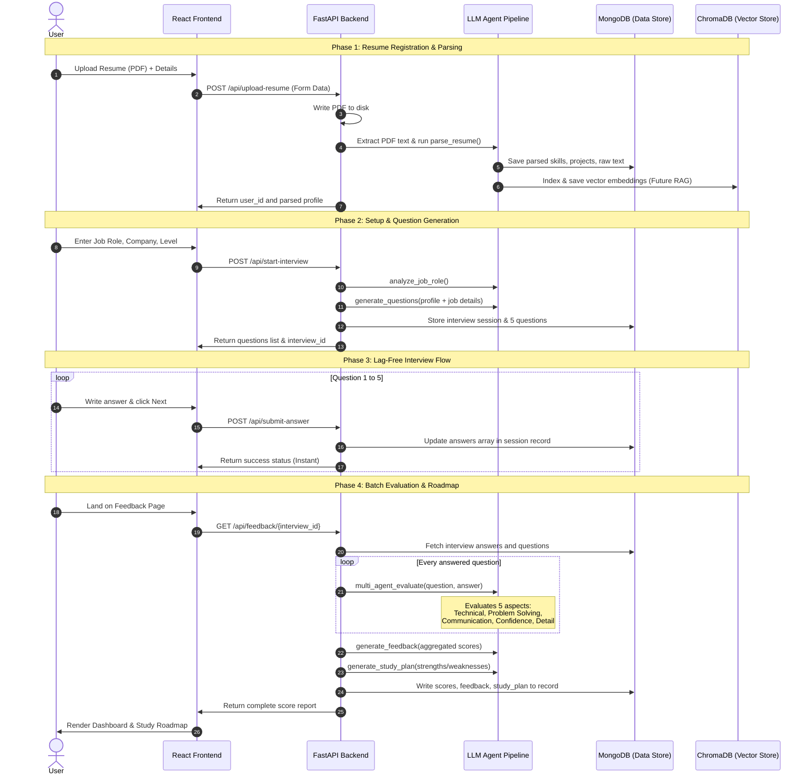

# Detailed Project Architecture, Tech Stack Analysis, & Future Roadmap

This document provides a deep-dive analysis of the **AI-Powered Multi-Agent Interview Prep Platform**, including the end-to-end data pipeline, the technical rationale behind our architectural choices, and a roadmap for future expansion.

---

## 1. Detailed End-to-End Architectural Flow

The application executes in five distinct phases:

### Detailed Execution Steps:
1. **Resume Processing:** A user uploads a PDF. PyPDF reads the document, and a structured LLM Agent extracts target lists of skills and projects. This structured profile acts as a caching layer to avoid reading the full PDF during every query.
2. **Personalization Engine:** A `JobAgent` conducts a preliminary profile match against the user's targeted company and seniority level. Using this job analysis, a `QuestionAgent` writes customized prompts to formulate exactly 5 targeted questions.
3. **Optimized Q&A Flow:** Answers are directly saved in MongoDB. Traditional LLM interfaces evaluate answers question-by-question, creating a 5–10 second delay between pages. Saving directly to MongoDB keeps the user's flow fluid.
4. **Multi-Agent Evaluation:** A sequence of 5 independent LLM evaluations assess the candidate's answers from specialized angles (e.g., assessing technical accuracy separate from communication style).
5. **Scorecard Compilation:** Feedback and Study Plan agents aggregate the numeric scores and write structured learning roadmap resources.

---

## 2. Tech Stack Analysis & Alternatives

When selecting the technologies for this platform, we optimized for **development speed, model orchestration flexibility, and response latency**.

| Component | Selected Stack | Alternatives Considered | Rationale |
| :--- | :--- | :--- | :--- |
| **Backend API** | **FastAPI** | Express.js (Node), Django (Python) | **FastAPI** runs natively on Python, which is required to integrate AI libraries like LangChain and PyPDF. Compared to Django, FastAPI is extremely lightweight, uses async execution by default, and auto-generates OpenAPI documentation. |
| **AI Orchestration** | **LangChain** | LlamaIndex, Raw API Calls | **LangChain** was chosen for its clean support for structured output parser schemas (`pydantic`) and modular agent design. While raw API calls are faster to set up initially, LangChain makes it trivial to swap LLM providers (Gemini, Groq, OpenAI) and chain agent inputs dynamically. |
| **Primary Database** | **MongoDB** | PostgreSQL, MySQL | **MongoDB**'s document-based model is perfect for unstructured and semi-structured data like resumes, LLM-generated JSON, and dynamic arrays of questions and evaluations. The fallback to `mongomock` allows running the entire stack locally without database installation overhead. |
| **Vector Database** | **ChromaDB** | Pinecone, Milvus | **ChromaDB** was selected because it is a lightweight, open-source, serverless vector store that can run locally on disk. It is ideal for prototyping and single-user instances, avoiding the cloud configurations and costs of Pinecone. |
| **Frontend** | **React (Vite)** | Next.js, HTML/JS | **Vite** builds extremely quickly and provides a highly responsive Single Page Application (SPA) flow. While Next.js is powerful, it introduces unnecessary server-side complexity for a client-side AI prep tool. |

---

## 3. Future Improvements

To take this project from a prototype to a production-grade application, the following improvements can be implemented:

### 1. Vector RAG Integration (Resume-based retrieval)
* **Goal:** Improve accuracy for long, complex resumes.
* **Implementation:** Activate the existing `ChromaDB` scaffolding. Chunk the resume text using recursive text splitters, embed the chunks using sentence-transformers, and perform semantic lookup. During question evaluation, query ChromaDB for the most relevant project detail matching the question topic, injecting that raw text into the LLM prompt.

### 2. Audio & Speech-to-Text Mock Interviews
* **Goal:** Simulate real-life verbal video interviews.
* **Implementation:** Integrate a Speech-to-Text API (like Whisper or AssemblyAI) on the frontend. Users talk into their microphone to answer questions, and the transcribed text is sent to the FastAPI backend. Integrate Text-to-Speech (like ElevenLabs) to speak the questions aloud.

### 3. Real-Time Video & Expression Analysis
* **Goal:** Grade the candidate's body language, eye contact, and facial expressions.
* **Implementation:** Leverage TensorFlow.js or a WebRTC stream on the frontend to track face vectors, counting blinks, micro-expressions, and head orientation to evaluate the candidate's focus and confidence.

### 4. Browser Focus & Cheat Detection
* **Goal:** Validate that the candidate is not copying answers from external tabs or AI tools.
* **Implementation:** Monitor browser focus states on the frontend. Log when users click off-screen, copy/paste content, or take excessive breaks between typing.

### 5. Company-Specific Question Banks
* **Goal:** Connect candidates with real, verified questions asked at targeted companies.
* **Implementation:** Build web scrapers or integrate API hooks with community sources (like Glassdoor or LeetCode) to automatically seed `company_questions_collection` in ChromaDB with real-world questions categorized by tag and role.
